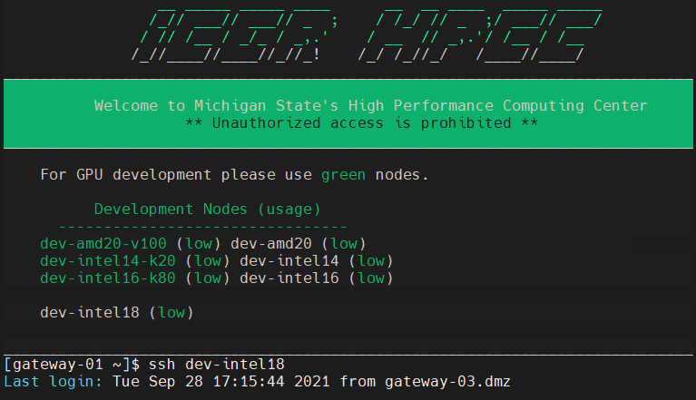
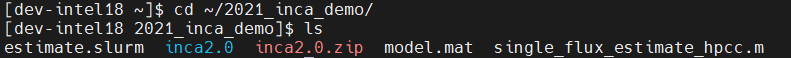
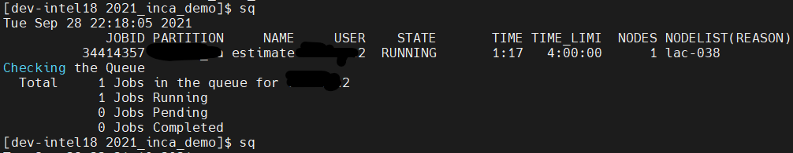
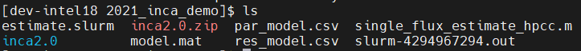

# Using INCA on HPCC 
## 1. Flux estimation

### Getting started with HPCC

- [Obtain a HPCC account](https://wiki.hpcc.msu.edu/display/ITH/Obtain+a+HPCC+account) 

- [Install SSH Client](https://wiki.hpcc.msu.edu/display/ITH/Install+SSH+Client) 

- [Connect to HPCC System](https://wiki.hpcc.msu.edu/display/ITH/Connect+to+HPCC+System) 

- [SSH Key-Based Authentication](https://wiki.hpcc.msu.edu/display/ITH/SSH+Key-Based+Authentication) 

- After accessing to HPCC Gateway via SSH client, access a development node from gateway with low usage. E.g. `ssh dev-intel18`.

  


- **DO NOT** use `dev-intel14` due to issues with MATLAB functions.

### Upload INCA to HPCC

- Get a free academic license for INCA (Isotopomer Network Compartmental Analysis) from [the Vanderbilt University website](http://mfa.vueinnovations.com/licensing) and download the MATLAB-based software package. 

- Upload the package e.g. `inca2.0.zip` from your local machine to a directory in your HPCC [home space](https://wiki.hpcc.msu.edu/display/ITH/Home+Space). E.g. `~/2021_inca_demo`.  Refer to file transfer documentation [here](https://wiki.hpcc.msu.edu/display/ITH/File+transfer).

- Unzip the package file

```bash
cd 2021_inca_demo/
unzip inca2.0.zip
```

- Note the path to the base directory of the INCA package, e.g. `~/2021_inca_demo/inca2.0`, you will need it later.

### Preparing files to be uploaded to HPCC

- Create a model file. Click `File` -> `Save Model As` in the GUI, it will save the model object into a .mat file, e.g. `model.mat`. The  model object contains a network model and the experimental datasets associated with it.

- Create a MATLAB (.m) script to run a single flux estimation for your model, e.g. `single_flux_estimate_hpcc.m` in this repository. Be sure to 1) change the path `~/2021_inca_demo/inca2.0` in line 11 to the one matching the base directory of the INCA package on your HPCC and 2) change the `matname` `model.mat` in line 19 if the name of your model file is different.

- Create a SLURM job script (just a text file containing job setup information for the HPCC scheduling system) e.g. `estimate.slurm` in this repository.  You can increase the time in the `#SBATCH --time=4:00:00` to up to 168:00:00. Learn more about the job script and job submission [here](https://wiki.hpcc.msu.edu/display/ITH/Job+Script+and+Job+Submission).

- Upload the above files `model.mat`,  `single_flux_estimate_hpcc.m`,  and `estimate.slurm` to a directory in your HPCC [home space](https://wiki.hpcc.msu.edu/display/ITH/Home+Space). E.g. `~/2021_inca_demo`. 

- `ls` to list all files in the working directory `~/2021_inca_demo`


### Submit the Job to the HPCC
- `cd` to the working directory and submit the job script `estimate.slurm` using `sbatch` command. If the command run successfully, the job controller will respond a job ID on the screen.
 

- Check job status using `sq` command
 

- Once the job is finished, output files containing the flux estimation (`par_model.csv`) and total squared residual of each measurement (`res_model.csv`) will appear in the working directory. `slurm-job-id.out` records the batch script's standard output.


